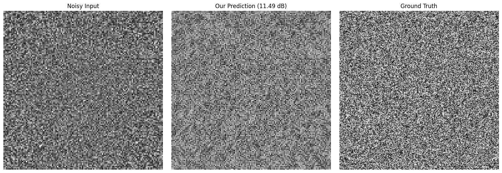
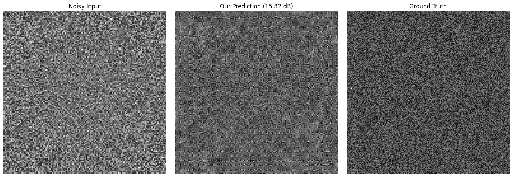
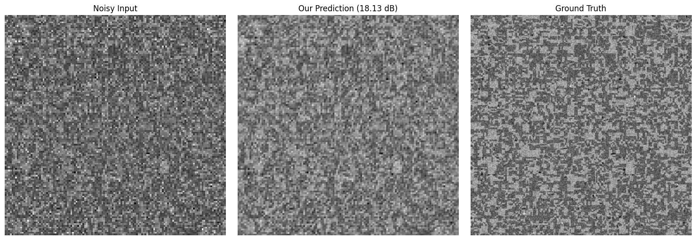

# AI-Based Restoration of Degraded Images — KLA Problem Statement

**Team:** TheEdgeCases · **Event:** Hackathon 2026, organized as part of SEMICON India
**College:** Indian Institute of Technology, Roorkee

| Role | Name |
| --- | --- |
| Team Leader | Sourav Gupta |
| Member | Mrityunjay Srivastava |
| Member | Vansh Garg |
| Member | Dishika Jitendra Vidhani |

Contact: souravgupta09295@gmail.com

Joint denoising and 2× super-resolution of degraded grayscale semiconductor
inspection images. A single feed-forward network (**JDSR-NAF**, 13.73 M
parameters) removes multiplicative speckle and additive noise while
recovering full spatial resolution in one pass.

---

## 1. Quick start

```bash
python -m venv .venv
source .venv/bin/activate          # Windows: .venv\Scripts\activate
pip install torch numpy

python run.py <input-dir> <output-dir>
```

Example:

```bash
python run.py ./Test_NoisyLR ./test_predictions
```

`run.py` is the submission entry point and takes two positional arguments.
It requires no internet access, API keys, model downloads, manual edits, or
interactive input. Model weights ship in `models/`. It runs on an NVIDIA GPU
when one is available and falls back to CPU automatically.

`run.py` is fully self-contained: it re-declares the network architecture
inline and imports only `torch` and `numpy` at runtime. `requirements.txt`
lists a broader set of packages used during development (see
[§7, Dependencies](#7-dependencies)); none of them are required for
inference.

## 2. Input / output contract

|            | Specification |
| ---------- | -------------- |
| Input      | `.npy`, grayscale, shape `(H, W)` (or `(H, W, 1)` — squeezed on load); values may fall outside `[0, 1]` |
| Output     | `.npy`, grayscale, shape `(2H, 2W)`, `float32`, clipped to `[0, 1]`, finite (no NaN/Inf) |
| Naming     | Each output file has exactly the same filename as its input |
| Output dir | Created automatically if it does not exist |

`torch.nan_to_num` and clamping to `[0, 1]` are applied inside `run.py`
before saving, so outputs are scored exactly as written to disk. Any input
side length is accepted — the network reflect-pads internally to a multiple
of 8 and crops back after upscaling. Inputs of differing sizes in the same
directory are handled correctly: images are grouped and batched by shape
before being passed through the model.

## 3. Repository contents

```
TheEdgeCases/
├── run.py                    # submission entry point — python run.py <in> <out>
├── requirements.txt          # full development environment (see §7)
├── README.md                 # this file
├── models/
│   ├── best.pt.gz            # submitted checkpoint (default weights, gzip-compressed)
│   └── best2.pt.gz           # secondary checkpoint, gzip-compressed
└── results/
    └── examples/             # documented worst-case validation failures (see §6.2)
```

`run.py` loads `models/best.pt.gz` by default (path resolved relative to the
script itself, so it works regardless of the current working directory).
`models/best2.pt.gz` can be used instead with `--weights models/best2.pt.gz`.

**This snapshot of the repository contains inference only.** The training
code, calibration scripts, and full evaluation harness that produced these
checkpoints are not included here — see
[§8, Known limitations](#8-known-limitations).

## 4. Problem understanding

The challenge is to restore paired GT/NoisyLR images degraded by three
composed mechanisms — downsampling, multiplicative speckle noise, and
additive Gaussian (shot) noise — with the order of application undisclosed.
Rather than assume a degradation model, we treated its recovery as a
statistical estimation problem and measured it directly from the paired
training data before designing the network. An assumed (rather than
measured) degradation model risks mismatching the real data-generating
process, which caps achievable restoration quality regardless of network
capacity — this was the central bet behind the whole approach.

## 5. Method

*(Summarized from project notes and the team's solution presentation;
retained here for problem-understanding context. The calibration/training
scripts that produced these results are not part of this repository
snapshot — see §8.)*

### 5.1 Degradation calibration

**This is the part of the approach we think was different from other teams':
instead of assuming a noise model, we downsampled and directly measured the
noise distribution on KLA's own dataset.** We are not aware of other teams
doing this measurement directly rather than assuming standard speckle/Gaussian
parameters. The measured parameters were then used to generate additional
synthetic degraded pairs from the ground-truth images, which served as an
extra validation set — letting us check generalization against data drawn
from the same measured distribution as the real hidden test set, rather than
only against the fixed 3,200 real pairs.

Concretely, the calibration was run as a statistical estimation problem over
the 3,200 provided GT/NoisyLR pairs:

- **Downsampling kernel recovery**: solved via least-squares regression
  against GT/NoisyLR patch pairs, exploiting the fact that mean-1
  multiplicative noise leaves the estimator unbiased. The recovered kernel
  was cross-validated against standard resamplers (area / bilinear / bicubic
  / Lanczos, with and without antialiasing) by MSE ranking.
- **Noise decomposition**: variance was modeled as a function of signal level,
  `Var(noise | μ) = a·μ² + b·μ + c`, fit by weighted least squares to separate
  the multiplicative (speckle), shot-noise, and additive-Gaussian components.
- **Noise application order**: resolved via spatial autocorrelation of the
  residual field (pre- vs. post-downsampling application leaves a different
  autocorrelation signature).

| Property | Measured value |
| --- | --- |
| Scale factor | 2× (all pairs are 256→128) |
| Downsampler | torch bicubic, `antialias=False`, `align_corners=False` |
| Noise variance | `Var(μ) ≈ 0.0197 μ² + 0.0055 μ` |
| Speckle | Gamma-distributed, L ≈ 40 (σ/μ ≈ 16%) |
| Additive term | signal-proportional (shot-like); near-negligible constant read-noise floor |
| Intensity range | NoisyLR ∈ approximately [−0.22, 2.16]; a small fraction of pixels fall outside [0, 1] |

Two findings shaped the architecture:

1. Since the downsampler is known, its closed-form pseudo-inverse (bicubic
   upsample) is added as a gated global residual inside the network,
   initialized to identity — the network predicts only the correction on top
   of it, which stabilizes early training.
2. Speckle noise is comparatively mild (L ≈ 40, not the much noisier L ∈
   [1, 12] range initially assumed), so the task leans more toward
   super-resolution than aggressive denoising; model capacity and receptive
   field were prioritized accordingly.

### 5.2 Architecture — JDSR-NAF (13.73 M parameters, `base` preset)

**Joint Denoising Super-Resolution NAFNet** — architected directly around
the calibration findings above, rather than adopting a single published
network unmodified.

```
input (B,1,H,W)
  ├── bicubic ×2 ─────────────────────────────────┐  (global residual, learnable gate init. to identity)
  └── SymlogStem: cat[x, sign(x)·log1p|x|] → 48ch  │
      ├── NAFBlock ×2  (3×3 depthwise)  ── skip ──┐│
      ├── NAFBlock ×2  (5×5 depthwise)  ── skip ─┐││
      ├── NAFBlock ×4  (7×7 depthwise)  ── skip ┐│││
      ├── MDTA TransformerBlock ×6, 8 heads     ││││
      ├── PixelShuffle decoder ×3 (ICNR init) ──┘┘┘│
      └── SRHead: sub-pixel ×2 → refine → 1ch ─────┴──→ clamp[0,1]
```

- **Residual-on-bicubic formulation**: since the measured downsampler is
  exactly bicubic, its pseudo-inverse is known in closed form. The network
  predicts a residual on top of a bicubic upsample, gated by a learnable
  scalar initialized to identity.
- **NAFNet-style gated encoder/decoder**: activation-free gated blocks with
  simplified channel attention form the backbone, reflecting the calibrated
  finding that speckle is mild and the task is primarily super-resolution
  rather than heavy denoising. Per-channel residual gates initialize to zero
  so depth trains stably.
- **Restormer-style channel attention at the bottleneck only**: channel-wise
  self-attention (MDTA), linear cost in spatial size, provides global context
  at the lowest-resolution feature map to help distinguish genuine structure
  from speckle using image-wide evidence. Runs internally in fp32
  (`F.normalize` underflows in fp16).
- **Depth-dependent kernel sizing (3→5→7)**: reflects the calibrated result
  that LR-stage noise is spatially near-white, so receptive field is
  allocated at deeper, computationally cheaper levels.
- **Symlog input representation**: a two-channel stem
  (`[x, sign(x)·log1p(|x|)]`) accommodates the small fraction of measurably
  negative input pixels (min ≈ −0.22) that a standard `log(x + ε)` transform
  cannot represent cleanly, while still compressing the multiplicative bright
  tail. Exactly 0 at 0, smooth and finite on all of ℝ.
- **ICNR-initialized sub-pixel convolution** on every upsampling stage,
  removing checkerboard-artifact initialization bias.
- **Zero-initialized output projection**, so the network begins training as
  an identity map onto the bicubic baseline.
- Three network presets (`tiny` ≈ 2.5 M, `base` = 13.73 M, `large` ≈ 26 M)
  provide a quality–latency trade-off consistent with the H100 inference-time
  evaluation axis. The submitted checkpoints use `base`.

### 5.3 Training (summary)

Two phases, both AdamW (`betas=(0.9, 0.99)`), cosine LR schedule with
warmup, mixed-precision (bf16/fp16), `channels_last`, gradient clipping at
1.0, EMA decay 0.999.

|            | Phase 1 (fidelity) | Phase 2 (perceptual) |
| ---------- | ------------------- | --------------------- |
| Loss       | Charbonnier + 0.15·(1 − SSIM) | + 0.12·LPIPS (ramped in) |
| Learning rate | 4e-4 → 1e-4 (extended) | 4e-5 |
| Epochs     | 30 + 20 | 15 |
| LR patch   | 96 × 96 | 96 × 96 |
| Batch      | 16 | 16 |

- **Synthetic data mixing**: each training sample was drawn either from a
  real provided pair or from a freshly synthesized pair generated from
  ground truth through the calibrated degradation simulator, extending
  exposure beyond the fixed set of real training realizations rather than
  a hand-specified noise model.
- **Dual validation tracking**: both an in-distribution validation split and
  a synthesized out-of-distribution split (widened noise parameters,
  alternate resamplers, content-scale jitter) were tracked, and checkpoint
  selection used the OOD split — directly addressing the stated mix of
  in-distribution and out-of-distribution hidden test content, and reporting
  an explicit generalization gap rather than assuming one doesn't exist.
- **Composite checkpoint selection**: `(PSNR/40 + SSIM + (1 − LPIPS)) / 3`
  rather than PSNR alone, since PSNR-only selection systematically favors
  over-smoothed checkpoints.
- **Augmentation**: D4 dihedral transforms, content-scale jitter, and spatial
  compositing of two independently-degraded versions of the same ground
  truth (teaching spatially adaptive restoration strength). CutMix/Mixup
  were tested and removed — they measurably hurt this dense-regression task
  (consistent with Yoo et al., *Rethinking Data Augmentation for Image
  Super-Resolution*, CVPR 2020).
- **Correctness safeguards**: EMA and raw checkpoint weights were validated
  separately to confirm which weights the reported metrics correspond to;
  stochastic depth was implemented as branch-level dropout rather than
  channel-level dropout to avoid conflicting with the adjacent
  channel-attention module.

`models/best.pt.gz` is the perceptual-phase checkpoint (final submission).
`models/best2.pt.gz` is a second checkpoint from the same project, kept as an
alternative.

## 6. Results

### 6.1 Reported validation metrics

*(Historical figures from project notes — see §8 on reproducibility.)*

| Model | PSNR ↑ | SSIM ↑ | LPIPS ↓ |
| --- | ---: | ---: | ---: |
| Bicubic upsample of noisy input (no learning) | 22.89 | — | — |
| Earlier baseline: lightweight RepConv CNN, 6 blocks | 27.69 | — | — |
| JDSR-NAF, fidelity phase | 28.735 | 0.7943 | 0.2377 |
| **JDSR-NAF, perceptual phase — submitted** | **28.51** | **0.7865** | **0.126** |

### 6.2 Failure analysis

The three worst validation-set predictions by PSNR, captured directly from a
failure-analysis run:

```
Loading slimmed model for Failure Analysis...
Scanning validation set to find the 3 worst failures...
Failure #1: 002973.npy | Score: 11.49 dB
Failure #2: 000407.npy | Score: 15.82 dB
Failure #3: 002534.npy | Score: 18.13 dB
```

| File | PSNR | Noisy input / Prediction / Ground truth |
| --- | ---: | --- |
| `002973.npy` | 11.49 dB |  |
| `000407.npy` | 15.82 dB |  |
| `002534.npy` | 18.13 dB |  |

All three worst cases share the same character: dense, high-frequency,
near-random-looking texture content where the model cannot reliably
distinguish genuine fine structure from speckle and ends up over-smoothing.
This is consistent with the failure mode noted in §8 — the network's
strength is at recovering coherent structure, and it is weakest exactly
where the ground truth itself looks closest to noise.

## 7. Dependencies

`requirements.txt` pins the full development environment used across data
calibration, training, and evaluation:

```
torch==2.5.1
numpy==2.1.3
lpips==0.1.4
scipy==1.14.1
scikit-learn==1.5.2
tqdm==4.67.1
matplotlib==3.9.2
```

**Only `torch` and `numpy` are required to run `run.py`.** The remaining
packages (`lpips`, `scipy`, `scikit-learn`, `tqdm`, `matplotlib`, plus
`OpenCV` and `torchvision` used during calibration/analysis) belong to
training/analysis tooling that is not part of this repository snapshot and
are not imported anywhere in `run.py`. They are listed for completeness of
the original environment rather than as an inference requirement.

Development hardware: a single CUDA GPU (NVIDIA Tesla T4) using
mixed-precision (bf16/fp16) and `channels_last` memory format. Target
inference hardware for the official benchmark is the specified NVIDIA H100;
`run.py`'s I/O, batching, and precision strategy are written against the
stated end-to-end runtime definition (disk read → CPU–GPU transfer →
inference → GPU–CPU transfer → write) but were not benchmarked on an H100
directly.

## 8. Runtime notes (from `run.py`)

- No `torch.compile` at inference — Inductor warmup (30–90 s) would dominate
  total runtime for a small test set.
- No `lpips` / `torchvision` / `matplotlib` / `pandas` imports anywhere in
  `run.py` — this keeps the inference path free of any package that could
  trigger a weight download (e.g. `lpips` pulls a 233 MB ImageNet backbone).
- Threaded parallel `.npy` reads and a background writer thread overlap disk
  I/O with GPU compute.
- Mixed-shape test sets are supported: inputs are grouped by shape before
  batching, so e.g. 128×128 and 256×256 files in the same directory are both
  handled correctly.
- `cudnn.benchmark` and TF32 matmul are enabled on CUDA devices.
- Precision: bf16 autocast where supported, fp16 fallback otherwise;
  `channels_last` memory format on GPU. Use `--fp32` to disable mixed
  precision entirely.
- End-to-end timing (read → transfer → inference → write) is printed to
  stderr after each run via `time.perf_counter()`.

## 9. Known limitations

- **Training and evaluation code are not included in this repository.** The
  scripts originally used to calibrate the degradation model, train the
  checkpoints, and compute PSNR/SSIM/LPIPS on a held-out split were lost and
  are not recoverable for this submission. Only the inference path
  (`run.py` + `models/`) is reproducible from what's here. The method
  description in §5 and the metrics in §6.1 are retained as documentation of
  the approach, not as a runnable pipeline; the failure-case images in §6.2
  and the console output they came from are the one piece of concrete,
  independently viewable evidence of validation performance included in this
  snapshot.
- **No 512×256 pairs were part of the original training data** (all provided
  pairs were 256→128), so behavior on 512×512 inputs is extrapolated rather
  than directly validated.
- **Highest error occurs on dense, high-frequency, near-random texture
  content** (see §6.2) — the model's failure mode is over-smoothing where
  genuine fine structure is hardest to distinguish from speckle.

## 10. Command-line reference

```
python run.py <input_dir> <output_dir>
    [--weights PATH]       # default: models/best.pt.gz
    [--batch_size N]       # default: 32
    [--preset {tiny,base,large}]
    [--scale N]
    [--no_ema]              # use raw weights instead of EMA shadow
    [--fp32]                # disable mixed precision
    [--read_workers N]      # default: 4
    [--quiet]
```

## 11. References

- Chen et al., ECCV 2022 — *Simple Baselines for Image Restoration* (NAFNet):
  activation-free gated blocks and simplified channel attention for
  low-cost, high-throughput restoration.
- Zamir et al., CVPR 2022 — *Restormer*: channel-wise self-attention (MDTA)
  with linear complexity for efficient high-resolution inference.
- Aitken et al., 2017 — ICNR initialization for checkerboard-artifact-free
  sub-pixel convolution.
- Yoo et al., CVPR 2020 — *Rethinking Data Augmentation for Image
  Super-Resolution*: basis for removing CutMix from the augmentation
  pipeline.

No external pretrained weights are loaded by `run.py`. `lpips` and the
torchvision AlexNet backbone were used only for the (now-absent) training
and evaluation tooling, never in the submitted inference path.

## 12. Contact

Sourav Gupta (team leader) · souravgupta09295@gmail.com
Repository: https://github.com/disvid/AI-Based-Restoration-of-Degraded-Images-for-Semiconductor-Inspection